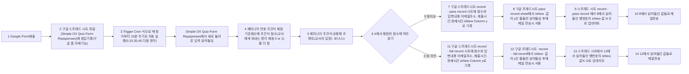
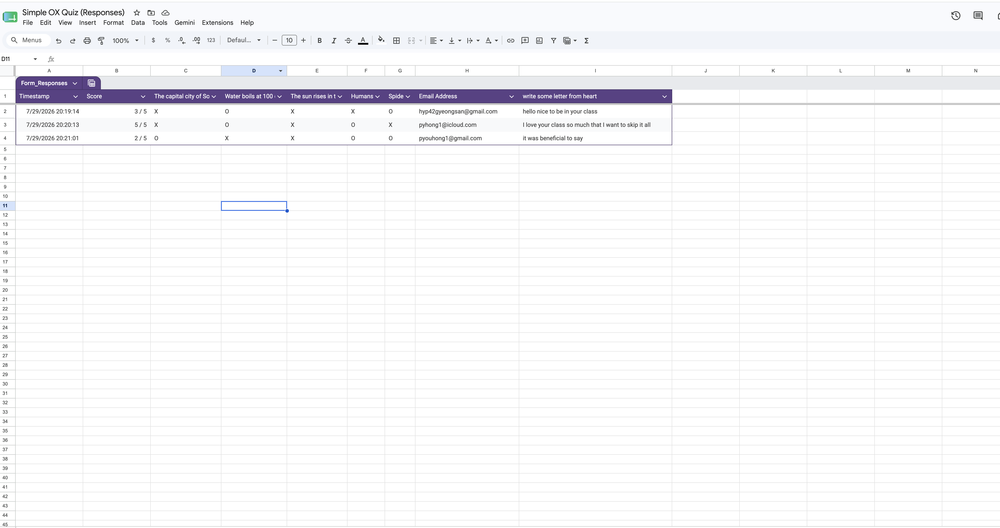

# 비교 분석 보고서

## 자동화 도구 구현(Make vs n8n) 과정 요약
매시간 정각 15분 30분 45분 별로 입력된 ox퀴즈결과에 ai를 이용해서 주관식(편지)을 체점하고 주관식에 코멘트(답장)를 달아서 점수에 따라 다른 시트에 기록하고 결과 메일을 전송하는 워크플로우 입니다. 

워크플로우:

### [n8n 구현]

#### n8n 워크 플로우 구현 화면 캡쳐 

### [Make 구현]

#### Make 워크 플로우 구현 화면 캡쳐 1(초기버전)

초기 구현 form에서 직접 읽어 들이는 기능을 사용해봤지만 n8n에서는 지원이 되지 않아 변경하였습니다.

#### Make 워크 플로우 구현 화면 캡쳐 2(실사용 버전)

n8n과 일치하게  Form spread sheet에 맞게 변경 되었습니다.

#### Make 특이사항

01 Aggregator

Gemini 채점, 답장 생성 답변이후 한번에 실행하기 위해 Aggregator 로 모아주어야 합니다.

02 Filter

Aggregator가 입력이 없는 경우도 취합하기 때문에 Filter가 필요합니다.

03 Cron 형

크론형 트리거로 작동 시키기 위해서 작동시간을 곧 있을 0,15,30,45 분중 하나로 맞춰주고 하루 종일 작동하게 맞춰 줌니다.

## [실행결과]
입력전

입력후

###공통

1회차: 주관식 미응답(0점추가 합격),주관식 조롱(0점추가 불합격),주관식 응답(1점 추가 합격)

2회차: 주관식 응답(1점추가) 불합격 된결과 입니다.

### n8n

#### 워크플로우 실행 히스토리

#### n8n 실행 결과 화면 캡처

### Make

#### 워크플로우 실행 히스토리

#### Make 실행 결과 화면 캡처
1.gmail1

2.gmail2

3. cloud mail

둘을 한꺼번에 작동 시킨 결과 마지막에 n8n 작업 내용을 읽어 들여서 실패 메일을 1개 더 전송하였으나 단독으로 작동 시킬 경우 로직 상에는 문제가 없어서 해당 테스트 내용을 첨부 하였습니다.

4 outlook

## 비교항목
|비교항목 | Make | n8n | 
| --- | --- | --- |
| 1 UI/UX|  | | 
| 2 설정난이도 |동일한 기능에 한하여 조금더 직관적이고  | | 
| 3 연동 서비스 범위 | | | 
| 4 무료플랜 | 매달 1000 크레딧 (core요금제 기준 1크레딧당 $0.0009) |영구적인 무료플랜 제공하지 않으나 자체호스팅 가능 이 경우 셀프 호스팅 비용 만큼으로 줄일 수 있음| 
| 5 구현 기능 편의성(스케줄, 업무단위 분리) |  | | 
| 결론 | 일반인이 사용하고 1달안에 많은 실행을 반복할 필요가 없는 경우에는 조금더 연동성이 편리한 |  | 

## [도구 장단점]

## [상황별 적합도 의견]

## [Bonus]
 AI 연동 Action 추가
 ### n8n
 
 ### Make